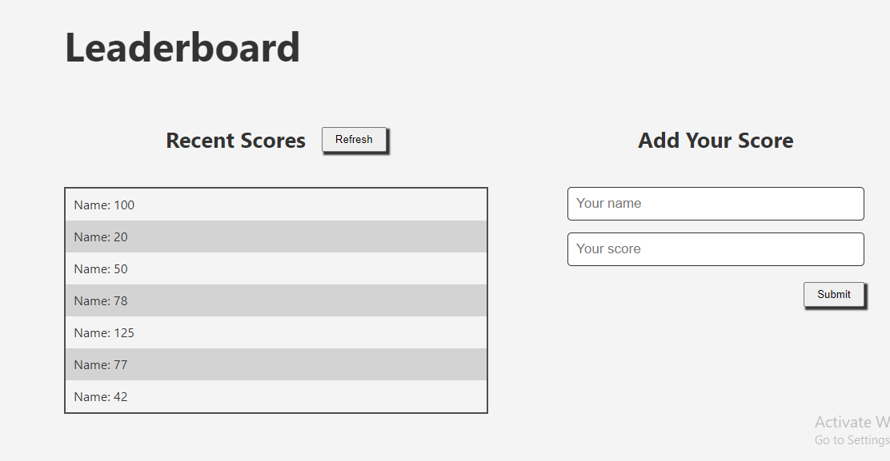

# Leaderboard
> Leaderboard is a website that has its data preserved with the external Leaderboard API serice. It displays the names and scores of different people and also allows you add your own score to the leaderboard.

# Getting Started

To get a local copy up and running follow these simple steps.

- You can clone this repo by typing `git clone https://github.com/AlaaAlsalem/-Leaderboard-Project.git` on your terminal.

- Type `cd Leaderboard-Project` to access the project on the terminal.
  
- Run `npm install` from your editor's terminal.

- Run `npm run build` from your editor's terminal.

- Run `npm start` from your editor's terminal to view the project in your browser.

# This project was built with:

HTML5

CSS3

JavaScript

Webpack

# Version Control System

GIT

# 👤 Author

GitHub: [@dammyShittu](https://github.com/AlaaAlsalem/)

LinkedIn: [Adedamola Shittu](https://www.linkedin.com/in/aladdin-alsalem-5a68ba1a0/)

# Show your support

Give a ⭐️ if you like this project!

# 📝 License

This project is [MIT](LICENSE) licensed.